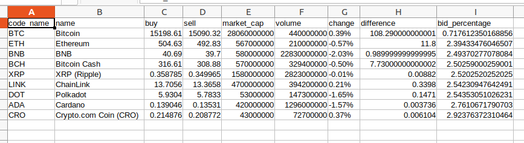

# Processing the `processed_data.csv` to generate `stats.csv`

Processes the `processed_data.csv` file by adding columns difference = buy - sell and bid_percentage = ((buy - sell) / sell) * 100, and produces the output in a new file `stats.csv` in the same folder.

## Pre-Requisites

Run The Command  `pip install -r requirements.txt`

## To Run the File

For Windows -  `python process_csv.py`

For Ubuntu/Linux - `python3 process_csv.py`

## Screenshots - 

### Screenshot of the generated .csv file

## *Author Name*

[Kartavya Shankar](https://github.com/kartavyashankar)